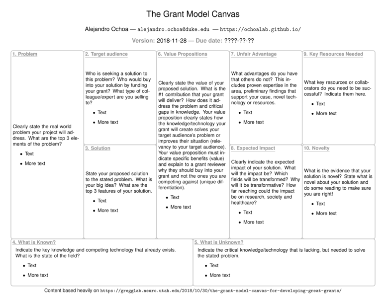

# The Grant Model Canvas for Developing Great Grants

This is a LaTeX version of the original 
[Grant Model Canvas](https://gregglab.neuro.utah.edu/2018/10/30/the-grant-model-canvas-for-developing-great-grants/)
from the The Gregg Lab at University of Utah, which was only available on Keynote, PowerPoint, and PDF formats.
The content of my template is essentially identical to that of the Gregg Lab's template and instructions.

My LaTeX code was derived from the "business" version of the Lean Model Canvas by
[Marc Moreaux](https://rememberthecmd.blogspot.com/2015/02/draw-business-model-generation-canvas.html).
